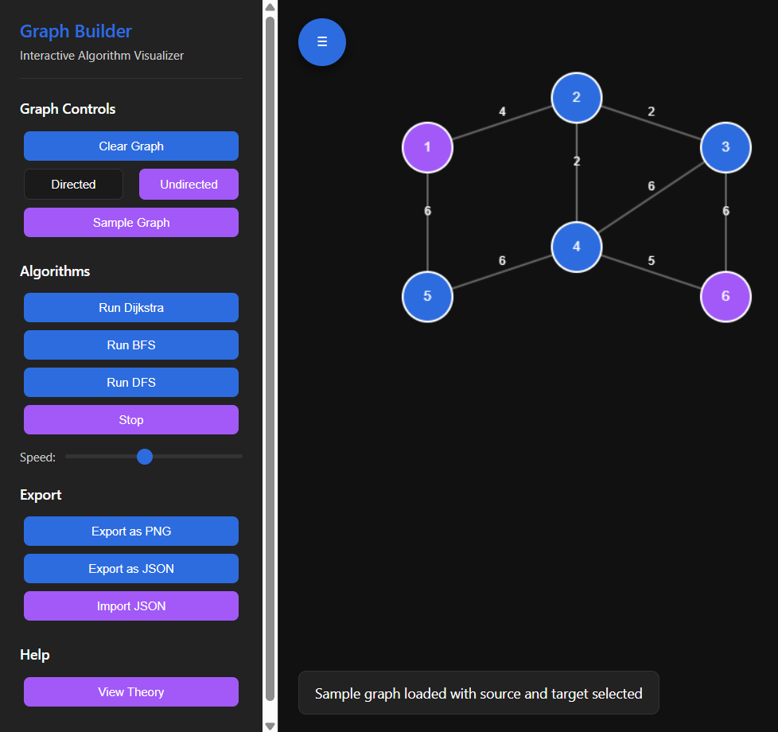

# MVP Graph Builder - Interactive Algorithm Visualizer

Project for prompt engineering practice

An interactive tool for visualizing graph algorithms with a clean, modern interface.  
Интерактивный инструмент для визуализации алгоритмов на графах с современным интерфейсом.

## Features / Возможности

### English
- **Graph Creation**:
  - Add nodes with left-click
  - Create edges by dragging between nodes
  - Right-click to delete elements
  - Toggle between directed/undirected graphs

- **Algorithms**:
  - Dijkstra's Algorithm (shortest path in weighted graphs)
  - Breadth-First Search (BFS)
  - Depth-First Search (DFS)
  - Adjustable visualization speed

- **Export/Import**:
  - Save as PNG image
  - Export/import graph as JSON

- **Learning**:
  - Built-in theory explanations
  - Sample graph with pre-selected source/target

### Русский
- **Создание графа**:
  - Добавление узлов: левый клик
  - Создание рёбер: перетаскивание между узлами
  - Удаление элементов: правый клик
  - Переключение между ориентированными/неориентированными графами

- **Алгоритмы**:
  - Алгоритм Дейкстры (кратчайший путь во взвешенных графах)
  - Поиск в ширину (BFS)
  - Поиск в глубину (DFS)
  - Регулируемая скорость визуализации

- **Экспорт/Импорт**:
  - Сохранение как PNG
  - Экспорт/импорт графа в JSON

- **Обучение**:
  - Встроенные теоретические пояснения
  - Пример графа с готовыми исходной и целевой вершинами

## How to Use / Как пользоваться

### English
1. **Create a Graph**:
   - Click anywhere to add nodes
   - Drag from one node to another to create edges
   - Right-click nodes/edges to delete them

2. **Run Algorithms**:
   - Select source node (Shift+Click)
   - Select target node (Shift+Click on another node)
   - Click an algorithm button (Dijkstra/BFS/DFS)
   - Use the slider to adjust animation speed

3. **Sample Graph**:
   - Click "Sample Graph" for a pre-built example

4. **Theory**:
   - Click "View Theory" for algorithm explanations

### Русский
1. **Создание графа**:
   - Кликните в любом месте для добавления узла
   - Перетащите от узла к узлу для создания ребра
   - Правый клик для удаления элементов

2. **Запуск алгоритмов**:
   - Выберите исходный узел (Shift+Клик)
   - Выберите целевой узел (Shift+Клик на другом узле)
   - Нажмите кнопку алгоритма (Дейкстра/BFS/DFS)
   - Используйте слайдер для изменения скорости анимации

3. **Пример графа**:
   - Нажмите "Sample Graph" для готового примера

4. **Теория**:
   - Нажмите "View Theory" для пояснения алгоритмов

## Technologies / Технологии
- Pure HTML5 Canvas (no external libraries)
- Vanilla JavaScript
- Modern CSS with variables

